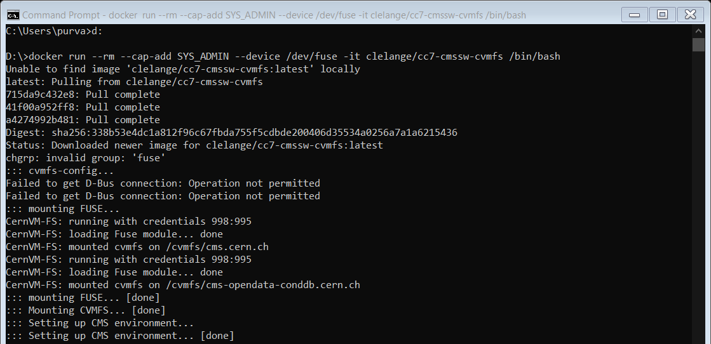
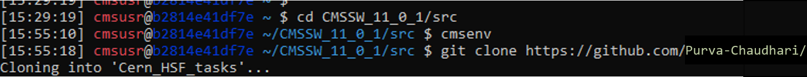

## Running inference on CMSSW framework (using non-standalone images) with docker (model1):
After starting the interactive shell of Docker type the following command:  
1) docker run --rm --cap-add SYS_ADMIN --device /dev/fuse -it clelange/cc7-cmssw-cvmfs /bin/bash  
(This may take few minutes to download and mount Fuse.)  
The output might look like the following:  

  
2) cmsrel CMSSW_11_0_1  
(This may take few minutes.)  
The output might look like the following:  

  
3) cd CMSSW_11_0_1/src  
4) cmsenv  
(This may take few minutes.)  
The output might look like the following:  

  
5) git clone https://github.com/Purva-Chaudhari/ML4Sci_Task.git 
The output might look like the following:  

6) cd Cern_HSF_tasks  
7) scram b  
The output might look like the following:  

8) python keras_inference.py  (Alternatively you can use cmsRun keras_inference.py)  
(This might take few minutes while executing for the first time. After first execution the rest of the executions will not take much time.)  
The script will ask the user to input batch size. The output might look like the following:  
Using python keras_inference.py-  
  
  
Using cmsRun keras_inference.py-  
  
